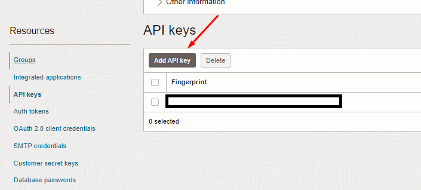
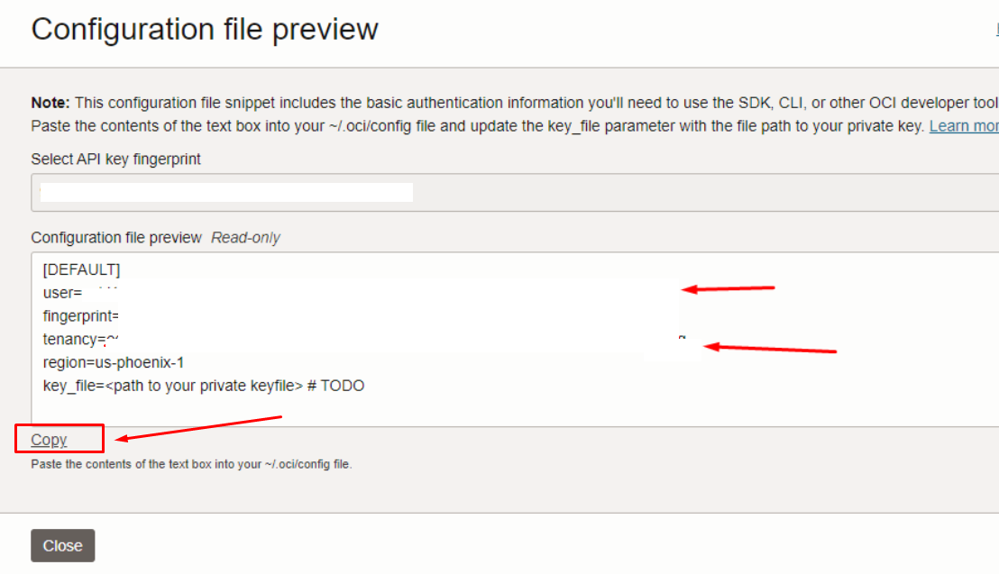
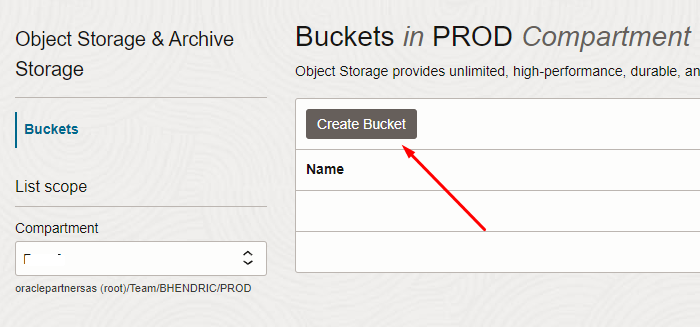
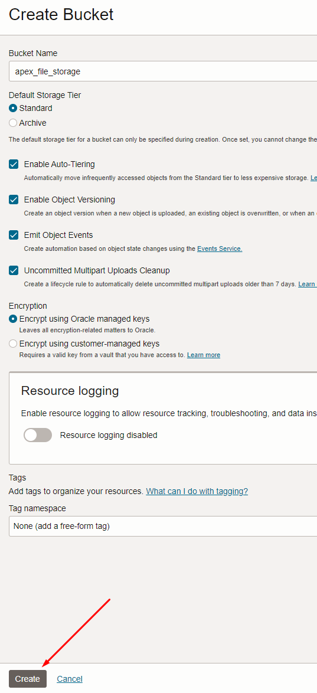

# Setup - Resources Setup

## Introduction

Welcome to Lab 1, where we will guide you through the essential steps to set up and configure your Oracle Cloud Infrastructure (OCI) environment. This lab focuses on two main areas: Identity Setup and Bucket Setup. By the end of this lab, you will have a functional compartment and policies for managing your cloud resources, as well as a properly configured bucket for storing and managing your objects in OCI.

In the Identity Setup section, you will learn how to create compartments, manage policies, and set up users with the necessary permissions to interact with OCI resources. Following this, the Bucket Setup section will walk you through the process of creating and configuring a storage bucket, essential for managing data and objects in your cloud environment.

This lab is designed for administrators and users with administrative rights within the OCI tenancy. It provides step-by-step instructions to ensure you can easily follow along and complete the setup efficiently. Let's get started and prepare your Oracle Cloud Infrastructure environment for optimal performance and management.

Estimated Time: 10 minutes

## Objectives

By completing this lab, you will achieve the following objectives:

- Create and configure a new compartment for managing resources in OCI.
- Establish policies to control access and permissions within the compartment.
- Set up a user specifically for API key management and interaction.
- Configure API keys for secure access and operations.
- Obtain necessary OCIDs for compartments, users, and tenancies.
- Create and configure a storage bucket in OCI.
- Generate a Pre-Authenticated Request (PAR) for secure bucket access.

With these objectives in mind, you will be well-equipped to manage and utilize Oracle Cloud Infrastructure effectively.

### Step 1: Create the PROD Compartment

1. Click the hamburger icon (≡) at the top left corner of the page.
2. Click Identity & Security. Hover over Identity and click the Compartment submenu item.
3. Click Create Compartment.
4. Enter the following information in the corresponding fields:
    - **Name**: PROD
    - **Description**: Compartment for PROD assets
5. Click Create to complete the process.
6. Save the compartment OCID for later use.
   

### Step 2: Create the Group and ProdObjectManagementPolicies Policy

1. Click the hamburger icon (≡), select Identity

Click Domain, Create a Domain. Fill out the information and confirm changes. 

2. After you create the domain, click on it. Click Create Group.

3. Enter the following information in the corresponding fields:
    1. **Name**: ProdObjectManagers
    2. **Description**: Users who can manage objects in compartment PROD
4. Add the users that you want to the group as well you should see it listed in the configuration box.
5. Click Create to complete the process.

1. Create the ProdObjectManagementPolicies policy in the root compartment:
2. Click the hamburger icon (≡), Click Identity & Security, and then click Policies.
   
3. Enter the following information in the corresponding fields:
    - **Name**: ProdObjectManagementPolicies
    - **Description**: Policies for users to manage objects in compartment PROD
    - **Policy Versioning**: Keep Policy Current

The members of the ProdObjectManagers group will require the ability to list the buckets in the compartment and manage any objects in these buckets. 

5. Add the following statements to allow the respective policy actions:
    - Allow group ProdObjectManagers to read buckets in compartment PROD
    - Allow group ProdObjectManagers to manage objects in compartment PROD
6. Click Create to complete the process.
    

### Step 4: Save User OCID and Create API Keys 

1. Click the profile icon in the top right of your OCI page, and click My Profile.
    
2. Save the user OCID for later use.
    

### Create OCI API Key

1. Select API KEYS under the resources section and add api key.
    
2. Click on download the private key and public key.

3. Save the contents of the private key in a separate document.
4. View the configuration file and select the copy button and save it in a separate document for later use.

5. Go ahead and close the tab after you have saved the contents. 

### Step 7: Grab Your Parent Tenancy OCID

1. Type tenancies in the OCI search bar, click the result, and then the tenancy name.

2. Copy the tenancy OCID and save it in a separate document for later use.

## Bucket Setup

### Step 1: Create a Bucket

In Oracle Cloud Infrastructure Object Storage, a bucket is a container for storing objects. To access a bucket through the Oracle Cloud Infrastructure REST APIs, complete the following identity management tasks using the Oracle Cloud Infrastructure console and an account that has administrative rights within the tenancy (the root compartment).

1. Log in to the Oracle Cloud Infrastructure console as an administrator.
2. Click the hamburger icon (≡), select Object Storage, and click Object Storage.
3. Ensure the PROD compartment is selected.

4. Click Create Bucket and provide the following information in the corresponding fields:
    - **Bucket Name**: Enter `apex_file_storage`, for example.
    - **Storage Tier**: Select Standard.
    - **Emit Object Events**: Uncheck this option.
    - **Encryption**: Select Encrypt Using Oracle Managed Keys.

5. Click Create Bucket to complete the process.
6. To prepare for the successful creation and discovery of the WSM data profile later, upload a dummy file to the `apex_file_storage` bucket now using the Oracle Cloud Infrastructure console.

### Step 2: Create a Pre-Authenticated Request (PAR)

1. Click Create Pre-Auth Request on the resources section from the newly created bucket.

2. Name the bucket and permit object reads and writes, enabling object listing.
3. Set the expiry date for the PAR to a time far in the future.
4. Click Create and save the pre-auth request URL in a document for later use.

