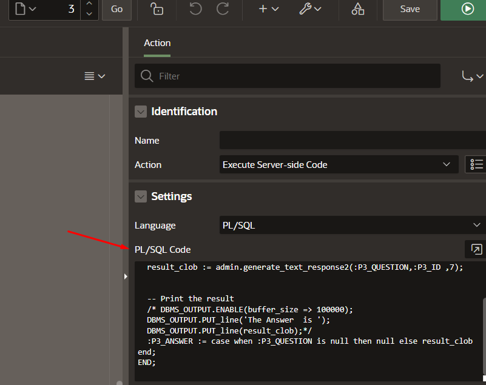

# Ask a Question

## Introduction

In this lab, we will load a document and ask a question about it. This process involves launching the application, uploading a document to object storage, selecting the document, previewing it, asking a question, displaying the results, and viewing the PL/SQL call that generates the response.

## Objectives

By following this guide, you will:

- Launch the application and sign in.
- Load a document to Oracle Object Storage.
- Select and preview the document.
- Ask a question about the document.
- Display the results of the question.
- View the PL/SQL call in the APEX Page Designer.

## Step-by-Step Guide

### Step 1: Launch Application

1. On the application home page, click on the application we uploaded and then select "Run Application".
   
   
2. Sign into the application with your credentials.

### Step 2: Load Document to Object Store

1. Click on the blue "Upload File" button.
2. Select the file you want to upload from your computer.
   This will upload it to the object storage.

### Step 3: Select Document from Drop-Down Menu

1. Select the item you just uploaded from the drop-down menu.

### Step 4: Preview

1. You can view the document you just uploaded by selecting the preview check box.

### Step 5: Type Question

1. After selecting the document, you can go ahead and ask a question about the document!

### Step 6: Display Results

1. After sending your question, you can view the results of the answer in the chat box.

### Step 7: Show PL/SQL Call

1. We can see the PL/SQL call in the APEX Page Designer on page 3.
   
2. On the right-hand side, we can view the call that is made to generate the response.
   

### PL/SQL Code

```sql
DECLARE
  result_clob CLOB;
BEGIN
  -- Call the function with the query
  result_clob := admin.generate_text_response2(:P3_QUESTION, :P3_ID, 7);
  
  -- Print the result
  /* DBMS_OUTPUT.ENABLE(buffer_size => 100000);
  DBMS_OUTPUT.PUT_LINE('The Answer is ');
  DBMS_OUTPUT.PUT_LINE(result_clob);*/
  
  :P3_ANSWER := CASE WHEN :P3_QUESTION IS NULL THEN NULL ELSE result_clob END;
END;
```

Explanation of PL/SQL Code:

DECLARE: This section is used to declare the variable result_clob, which will hold the CLOB data type result.
BEGIN: Marks the beginning of the executable part of the PL/SQL block.
result_clob := admin.generate_text_response2(,,7);: Calls the generate_text_response2 function from the admin package. It passes three parameters:
1. :P3_QUESTION: The question entered by the user. 
2. :P3_ID: The ID of the document selected by the user.
3. 7: A static parameter
:= CASE WHEN
IS NULL THEN NULL ELSE result_clob END;: Assigns the result of the function to the page item :P3_ANSWER. If the question is null, the answer will also be null; otherwise, it assigns the result of the function call.
END: Marks the end of the PL/SQL block.